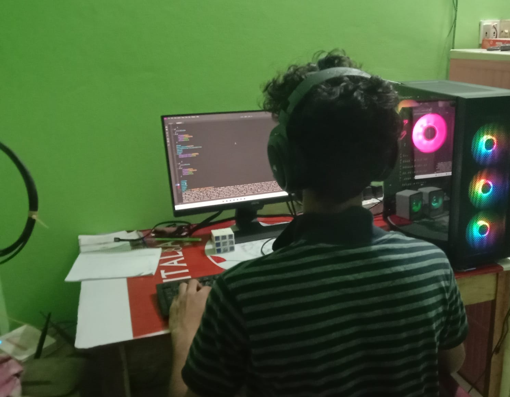

<!-- banner image starts here  -->

<!-- banner image ends here  -->

<h1> 👋 Hello, I'm Mehedi Hasan </h1>

A full time content creator on & web developer  
🏠 &nbsp; Living: Sherpur, Mymensingh.

<!-- Contact me section starts here  -->

 
 

<!-- Contact me section ends here  -->

<!-- about-me section starts here  -->

### 👨‍🏫 &nbsp; About Me

 Hi, I’m Mehedi Hasan! I’m a web developer with in-depth experience in UI/UX design. In a nutshell, I create websites that help organizations address business challenges and meet their needs. I manage everything from website navigation and layout to a company’s web hosting and security architecture. My expertise lies within front-end web apps, and the main languages in my tech stack are JavaScript, React, and of course HTML/CSS. I’m a lifelong learner (currently taking a course on building AI chatbots with Python!) and love to read, run, and find new bubble tea shops in Bangladesh.

 
<!-- about-me section ends here  -->

 
 
 

   

<!-- github stats starts here  -->

 

<!-- github stats ends here  -->
 

 

<!-- latest youtube videos ends here -->

<!-- other skills and my videos for computer science section starts here  -->

<!-- work experience section starts here  -->

<!-- ### 💼 &nbsp; Employment History

| Position            | College                                   | Duration            | Location           |
| ------------------- | ------------------------------------------- | ------------------- | ------------------ |
| Student  | Sherpur Govt College                                  |  Running  | Sherpur, Mymensingh | -->
| 
 
<!-- work experience section ends here  -->
<!-- education section starts here  -->

### 👨🏻‍🎓 &nbsp; Education
1. SSc in Arts, Bibirchar Rahmaniya Fazil Madrasha.
2. HSC in commerce, Ideal Technical & BM College.
3. BBA in Sherpur Govt College.

 

<!-- education section ends here  -->

<!-- my languages section starts here  -->

### Languages:

- 🇧🇩 Bangla : Native
- 🏴󠁧󠁢󠁥󠁮󠁧󠁿 English : Basic
   

<!-- my languages section ends here  -->

<!-- my sports and game section starts here  -->

### Sports / Game / Activities / Hobby:
- ⚽ Football, 🏸 Badminton,
-  🏃‍♂️ Running, 🚶‍♂️ Walking
- ✈️ Travelling

 
<!-- my sports and games section ends here  -->

<!-- Honors & awards section starts here  -->

Thanks for going through my Portfolio.
All rights reserved by Mehedi Hasan @2023.

---

<!-- my achievement section ends here  -->